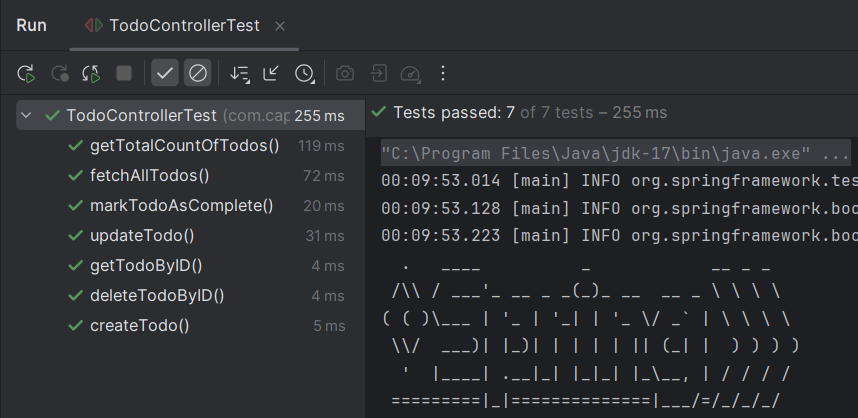

# Todo Application

This is a Spring Boot application that allows you to manage a list of todo items. It uses MySQL as the database and provides a RESTful API for CRUD operations on todo items.

## Prerequisites

- Java 8 or later
- Docker
- Docker Compose (optional)
- IntelliJ IDEA or Eclipse (or any other Java IDE)
- Postman or cURL (for testing the API)

## Getting Started

### Install Docker Desktop

Install Docker Desktop on your machine by following the official installation guide for your operating system: https://www.docker.com/get-started

### Run MySQL Container

To run a MySQL container for the application, execute the following command:
<div class="code-snippet">
    <button class="copy-button" aria-label="Copy code" data-clipboard-target="#code-1">
        <svg xmlns="http://www.w3.org/2000/svg" viewBox="0 0 24 24" width="18" height="18">
            <path fill="none" d="M0 0h24v24H0z"/>
            <path d="M16 1H4c-1.1 0-2 .9-2 2v14h2V3h12V1zm3 4H8c-1.1 0-2 .9-2 2v14c0 1.1.9 2 2 2h11c1.1 0 2-.9 2-2V7c0-1.1-.9-2-2-2zm0 16H8V7h11v14z"/>
        </svg>
    </button>
    <pre><code id="code-1">docker run --name todoMysql -e MYSQL_ROOT_PASSWORD=root -e MYSQL_DATABASE=tododb -p 3306:3306 -d mysql:8
</code></pre>
</div>

This command will create a MySQL container named `todoMysql` with the following configurations:

- `MYSQL_ROOT_PASSWORD`: Set the root password to `root`
- `MYSQL_DATABASE`: Create a database named `tododb`
- `-p 3306:3306`: Map the container's port `3306` to the host's port `3306`

### Run the Application

1. Open the project in IntelliJ IDEA or Eclipse.
2. Build the project to resolve any dependencies.
3. Run the `TodoApplication` class or use the appropriate run configuration in your IDE.

### Test the Endpoints

Once the application is running, you can test the endpoints using Swagger or Postman.

#### Swagger

Access the Swagger UI by navigating to `http://localhost:8080/swagger-ui/index.html` in your web browser. This will allow you to interact with the API and test the various endpoints.

#### Postman

Import the Postman collection (if provided) into Postman or use cURL to send requests to the API endpoints.

### Check the Data in the Container

To check the data in the MySQL container, follow these steps:

1. Open a new terminal or command prompt.
2. Execute the following command to connect to the MySQL container:
<div class="code-snippet">
    <button class="copy-button" aria-label="Copy code" data-clipboard-target="#code-1">
        <svg xmlns="http://www.w3.org/2000/svg" viewBox="0 0 24 24" width="18" height="18">
            <path fill="none" d="M0 0h24v24H0z"/>
            <path d="M16 1H4c-1.1 0-2 .9-2 2v14h2V3h12V1zm3 4H8c-1.1 0-2 .9-2 2v14c0 1.1.9 2 2 2h11c1.1 0 2-.9 2-2V7c0-1.1-.9-2-2-2zm0 16H8V7h11v14z"/>
        </svg>
    </button>
    <pre><code id="code-1">docker exec -it todoMysql mysql -u root -p
</code></pre>
</div>

3. When prompted, enter the root password (`root`).
4. Once connected, switch to the `tododb` database by running:

```sql
USE tododb;
SELECT * FROM todos;
```

### Running the Tests

To run the tests in IntelliJ IDEA, follow these steps:

1. Open the project in IntelliJ IDEA.
2. Navigate to the `TodoControllerTest` class.
3. Right-click on the class or a specific test method and select `Run 'TodoControllerTest'`.</code></pre>
</div>

This will execute the test cases for the `TodoController`.


